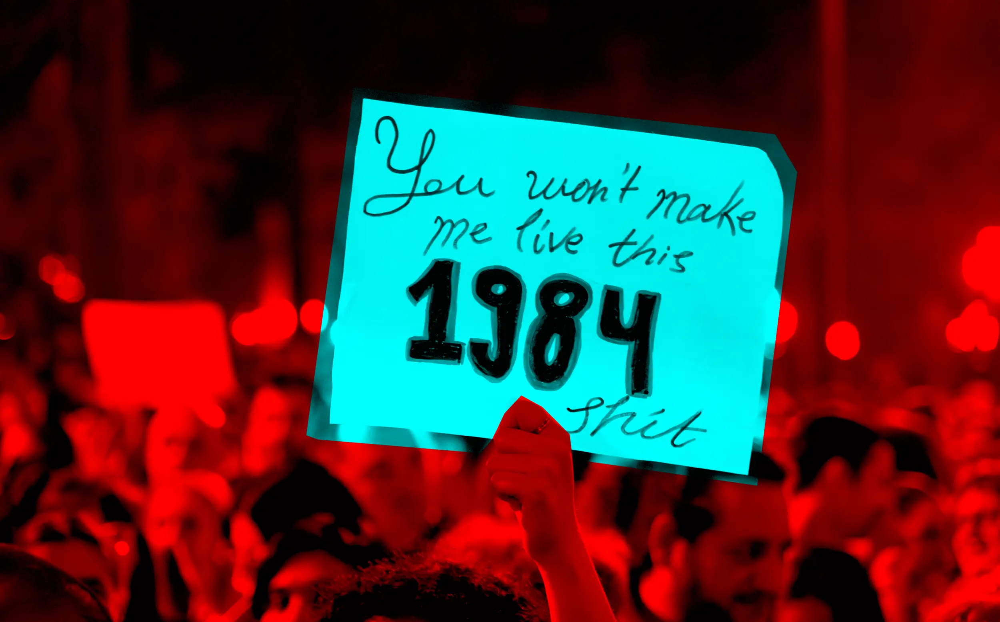
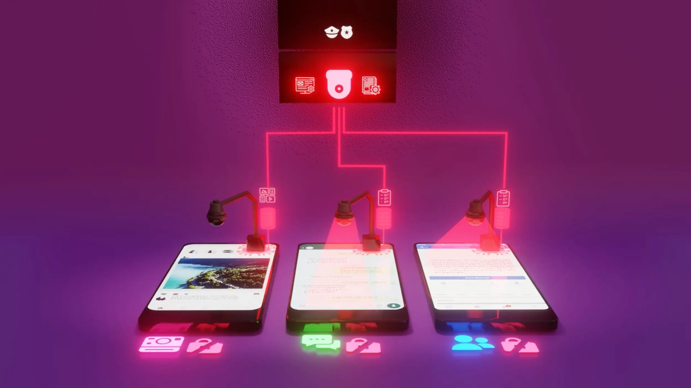
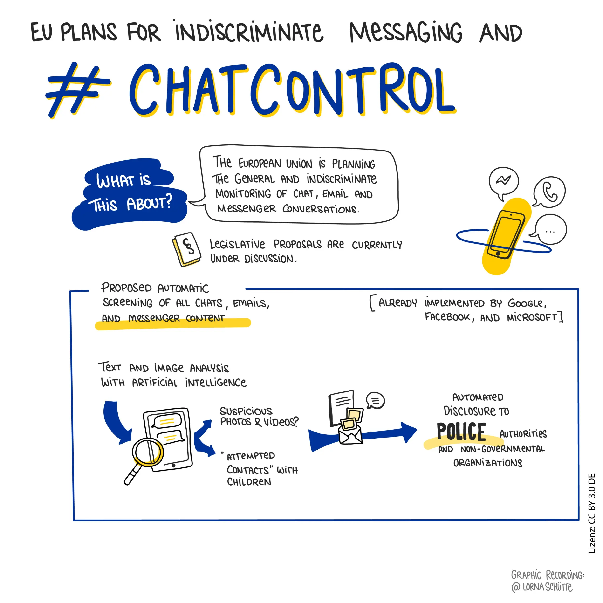
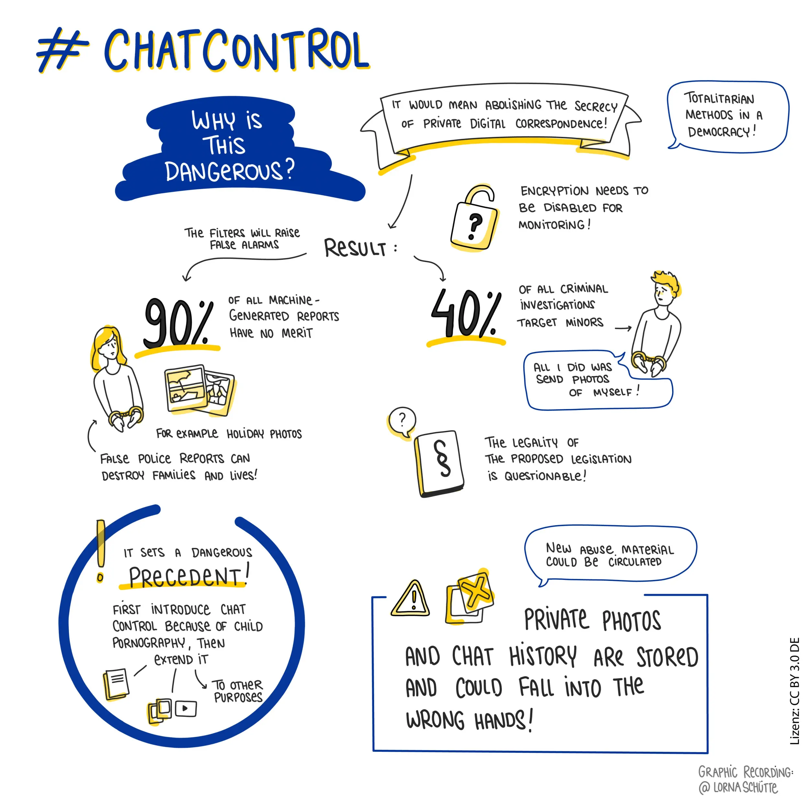

---
date:
    created: 2025-09-08T18:00:00Z
categories:
    - News
authors:
    - em
description:
    Chat Control is back to undermine everyone's privacy. There's an important deadline this Friday on September 12th. We must act now to stop it!
schema_type: ReportageNewsArticle
preview:
  cover: blog/assets/images/chat-control-must-be-stopped/chatcontrol-cover.webp
---

# Chat Control Must Be Stopped, Act Now!

<small aria-hidden="true">Illustration: Em / Privacy Guides | Photo: Ramaz Bluashvili / Pexels</small>

If you've heard of [Chat Control](the-future-of-privacy.md) already, bad news: **it's back**. If you haven't, this is a pressing issue you should urgently learn more about if you value privacy, democracy, and human rights. This is happening **this week**, and **we must act to stop it right now**.<!-- more -->

Take a minute to visualize this: Every morning you wake up with a police officer entering your home to inspect it, and staying with you all day long.

The agent checks your bathroom, your medicine cabinet, your bedroom, your closets, your drawers, your fridge, and takes photos and notes to document everything. Then, this report is uploaded to the police's cloud. It's "[for a good cause](encryption-is-not-a-crime.md)" you know, it's to make sure you aren't hiding any child sexual abuse material under your bed.

Every morning. Even if you're naked in bed. Even while you're having a call with your doctor or your lover. Even when you're on a date. Even while you're working and discussing your client's confidential information with their attorney. This police officer is there, listening to you and reporting on everything you do.

This is the in-person equivalent of Chat Control.

Chat Control is a regulation proposal that would mandate **all** services to scan **all** private digital communications of **everyone** residing in the European Union ([more details](#what-is-chat-control) below).

This is an Orwellian nightmare.

## Act now!

This is happening **this week**. European governments will be finalizing their positions on the regulation proposal on **Friday, September 12th, 2025**.

- ==If you are not located in Europe==: Keep reading, this will affect you too.

- If you are still unconvinced: Keep reading, we discuss Chat Control in [more details](#why-is-this-bad) below.

- If you are located in Europe: You must **act now** to stop it.

How to stop this? Contact your MEPs before September 12th

Use this [**website**](https://fightchatcontrol.eu/) to easily contact your government representatives before September 12th, and tell them they should **oppose Chat Control**. Even if your country already opposes Chat Control, contact your representatives to tell them you are relieved they oppose, and support them in this decision to protect human rights. This will help reinforce their position.

But if your country *supports* Chat Control, or is *undecided*, **it is vital that you contact your representatives before this deadline**. To support your point, you can share this article with them or one of the many great [resources](#resources-to-learn-more-and-fight-for-human-rights) listed at the end.

At the time of this writing, the list of countries to contact is:

| **Supporting (15)**                |                                     | **Undecided (6)**    |
| ---------------------------------- | ----------------------------------- | -------------------- |
| :triangular_flag_on_post: Bulgaria | :triangular_flag_on_post: Latvia    | :warning: Estonia    |
| :triangular_flag_on_post: Croatia  | :triangular_flag_on_post: Lithuania | :warning: Germany    |
| :triangular_flag_on_post: Cyprus   | :triangular_flag_on_post: Malta     | :warning: Greece     |
| :triangular_flag_on_post: Denmark  | :triangular_flag_on_post: Portugal  | :warning: Luxembourg |
| :triangular_flag_on_post: France   | :triangular_flag_on_post: Slovakia  | :warning: Romania    |
| :triangular_flag_on_post: Hungary  | :triangular_flag_on_post: Spain     | :warning: Slovenia   |
| :triangular_flag_on_post: Ireland  | :triangular_flag_on_post: Sweden    |                      |
| :triangular_flag_on_post: Italy    |                                     |                      |

<small aria-hidden="true">Image: Patrick Breyer / [chatcontrol.eu](https://www.chatcontrol.eu)</small>

## What is Chat Control?

The push for Chat Control started in 2021 with the approval of a [derogation](https://www.patrick-breyer.de/en/chatcontrol-european-parliament-approves-mass-surveillance-of-private-communications/) to the ePrivacy Directive by the European Parliament. This derogation escalated to a second proposal for *mandatory* scanning a year later, which was [rejected](https://fortune.com/europe/2023/10/26/eu-chat-control-csam-encryption-privacy-european-commission-parliament-johansson-breyer-zarzalejos-ernst/) in 2023. Nevertheless, lawmakers and lobbyists determined to undermine our safety and civil liberties are bringing it back again two years later, **literally trying to wear you down**.

We cannot let authoritarians wear us down until we lose all our privacy rights. Our privacy rights are fundamental to so many other human rights, to civil liberties, to public safety, and to functioning democracies.

Chat Control undermines all of this.

Cryptography professor and cybersecurity expert Matthew Green described the 2022 proposal document for Chat Control as "[**the most terrifying thing I've ever seen**](https://fortune.com/2022/05/12/europe-phone-surveillance-crackdown-child-sexual-abuse-material-sparks-outrage-among-cybersecurity-experts-privacy-activists/)".

And terrifying, it is.

The [most recent proposal for Chat Control](https://tuta.com/blog/chat-control-criticism) comes from the EU Council Danish presidency pushing for the regulation misleadingly called the Child Sexual Abuse Regulation (CSAR). Despite its seemingly caring name, this regulation will **not** help fight child abuse, and will even likely worsen it, impacting negatively what is already being done to fight child abuse (more on this in the [next section](#would-this-protect-the-children)).

The CSAR proposal (Chat Control) could be implemented as early as *next month*, if we do not stop it. Chat Control would make it mandatory for *all* service providers (text messaging, email, social media, cloud storage, hosting services, etc.) to scan *all* communications and *all* files (including end-to-end encrypted ones), in order to supposedly detect whatever the government deems "abusive material."

**The problem is this: Chat Control will not work, it is unreliable, it will escalate in scope, and it will endanger everyone (including the children).**

Even if you are not in Europe, know that Chat Control will affect everyone inside *and* outside of Europe one way or another. Regardless of where you are, you should be concerned and pay attention, and there are things you can do to fight back. This is important.

<small aria-hidden="true">Still image from [video](https://stopscanningme.eu/video/csar-explainer.mp4): Stop Scanning Me / EDRi</small>

## Why is this bad?

The idea that it's possible to somehow [magically protect](encryption-is-not-a-crime.md/#magical-backdoor-only-for-the-good-guys-is-a-complete-fantasy) information properly while giving access to unquestionably well-intended law enforcement comes from either extreme naivety, lack of information, and plain dishonesty.

This proposal would effectively break any end-to-end encryption protections, and potentially expose all your files and communications to not only law enforcement, but eventually also to criminals of all sorts (with the data breaches, data leaks, and corruption that will inevitably follow).

Here's a summary of some dangers this regulation would create if approved:

- **Breaking end-to-end encryption**: Removing crucial protections for all sensitive files and communications of vulnerable populations, victims, whistleblowers, journalists, activists, and everyone else.

- **Mission creep**: Once this mass surveillance system is in place, authorities can decide to add more criteria such as searching all communications for references to drug use, protest attendances, political dissidence, or even [negative comments](https://www.lemonde.fr/en/international/article/2025/03/22/how-a-french-researcher-being-refused-entry-to-the-us-turned-into-a-diplomatic-mess_6739415_4.html) about a leader. Europol (the EU law enforcement agency) has already called for [expanding the program](https://www.youtube.com/watch?v=L933xDcSS3o&t=2016s).

<small aria-hidden="true">Image: Lorna Schütte / [chatcontrol.eu](https://www.chatcontrol.eu)</small>

- **Criminal attacks**: Each time a backdoor exists, it doesn't take long for criminals to find access and steal our information. This could include criminals finding access to each service independently or to the entire database authorities would keep. A database that would be filled with material tagged as sexually explicit text or photos of children. This could even *create* new Child Sexual Abuse Material (CSAM) for criminals. For example, consenting teenagers innocently sexting together could have their photos collected in this database, after being wrongly flagged by the automated system. Then, criminals could steal their intimate photos from the governments.

- **False positives**: With a mass surveillance system this large, moreover a system with no transparency and little oversight, false positives are inevitable. Despite marketing promises from the [organizations lobbying government officials](https://www.patrick-breyer.de/en/chat-control-eu-ombudsman-criticises-revolving-door-between-europol-and-chat-control-tech-lobbyist-thorn/), we all know AI technologies regularly misfire and cannot be reliable for anything of such importance. Loving parents could get flagged as pedophiles just for innocently uploading a photo of their child in the bathtub on their *private* cloud. Teenagers exploring their sexuality consensually with each other could get tagged as sexual predators (a label that might stick on them decades later). The police could receive reports for breastfeeding mothers. The list is infinite.

<small aria-hidden="true">Image: Lorna Schütte / [chatcontrol.eu](https://www.chatcontrol.eu)</small>

- **Overwhelming resources**: The inevitable false positives will completely overwhelm the agencies responsible for investigating flagged material. This will cost them precious time they will not have to investigate *actual* abuse cases. Organizations fighting child sexual abuse are already overwhelmed and lack resources to prosecute real criminals.

- **Hurting victims**: Such system of mass surveillance could prevent victims of child sexual abuse (and other crimes) to reach out for help. Knowing that all their communications would be scanned, they would lose all confidentiality while reporting crimes. The evidences they share could even be tagged by Chat Control, as if they were the perpetrator rather than the victim. Sadly, many will likely decide it's safer not to report at all.

- **Self-censorship**: With Chat Control in place, not only victims might censor themselves and stop reaching out for help, but everyone else as well. When people know they are being observed, they feel less free to be themselves and to share openly. This is doubly true for anyone who is part of a marginalized group, such as [LGBTQ+ people](importance-of-privacy-for-the-queer-community.md), or anyone who is being victimized or at risk of victimization.

<small aria-hidden="true">Image: Lorna Schütte / [chatcontrol.eu](https://www.chatcontrol.eu)</small>

- **Undermining democracy**: This surveillance system would allow governments to spy on opposition. Chat logs from opposing candidates, activists, and journalists could all be accessed by authorities in order to silence opponents or blackmail candidates. Even if you trust your government to not do this now, this doesn't mean it could not be used in this way by the next government. We have all seen how fast the political landscape can change.

- **Violating the GDPR (and other laws)**: The General Data Protection Regulation (GDPR) offers wonderful protections to Europeans. Sadly, Chat Control would make a complete farce of it. The Right to Erasure (right to delete) could be reduced to ashes by Chat Control, including for any highly sensitive information wrongly caught in the CSAR net. Moreover, it would [violate Article 7 and Article 8](https://tuta.com/blog/chat-control-criticism) of the EU Charter of Fundamental Rights.

Protecting the children is only the excuse used in hope of convincing a misinformed public. **Chat Control is authoritarian mass surveillance.**

Authorities understand well how important protecting communication and information is. This is why they included an exemption to protect *their own* communications, but not yours.

## Would this protect the children?

No.

This cannot be stressed enough: **This regulation would not protect the children, it would *harm* the children**, and everyone else too, worldwide. Claiming otherwise is either naivety, or misinformation.

Last year, the civil and human rights association European Digital Rights (EDRi) put together a [joint statement from 48 organizations](https://edri.org/our-work/joint-statement-on-the-future-of-the-csa-regulation/) for children's protection, digital rights, and human rights, demanding that the European Parliament invest instead in proven strategies to fight child abuse. This appeal to reason does not seem to have been heard by most EU Member States.

There are many things we can do as a society to increase protections for children and fight abusers and criminals, but Chat Control is far from it all. Protection of the children is clearly only an excuse here, and a very misleading one.

<small aria-hidden="true">[Image](https://stopscanningme.eu/en/organise-now.html): Stop Scanning Me / EDRi</small>

### Mislabelling children as criminals

First, this automated system is flawed in many ways, and the false-positive rate would likely be high. But let's imagine that, magically, the system could flag CSAM at an accuracy rate of 99%. This still means 1% of reports would be false. Expanded to the size of Europe Union's population of approximately 450 million people, exchanging likely billions of messages and files every day, this still means millions could be falsely tagged as sexual predators, with all the [consequences](https://www.republik.ch/2022/12/08/die-dunklen-schatten-der-chatkontrolle) this implies.

Worse, the Swiss federal police reported that currently about 80% of all automated reports received were [false-positives](https://www.patrick-breyer.de/en/posts/chat-control/#WhatYouCanDo). This means in reality, the error rate is likely far higher than 1%, and actually closer to an **80% error rate**. Of the approximate 20% of positive reports, in Germany, over 40% of investigations initiated [targeted children](https://www.polizei-beratung.de/aktuelles/detailansicht/straftat-verbreitung-kinderpornografie-pks-2022/) themselves.

Sometimes, flagged content is simply teenagers innocently sexting each other consensually. Not only would they be wrongly tagged as criminals under Chat Control, but they'd be triggering an investigation that would expose their intimate photos to others.

Even in a magical world where Chat Control AI is 99% accurate, it would still wrongly tag and **expose sensitive data from millions of children**. In reality, no AI system is even remotely close to this accuracy level, and proprietary algorithms are usually opaque black boxes impossible to audit transparently. The number of children Chat Control would harm, and likely traumatize for life, would be disastrous.

### Exposing children's sensitive and sexual information

Any content that could be deemed suspicious or explicit by the system, accurately or not, would be flagged and reported.

When this content is reported, it will likely be uploaded to a database for human review. This means that if a teenager was sending an intimate photo of themselves to another consenting teenager, they could be flagged as sharing CSAM, even if it's their own photo. Then, their photo would be sent to the police for review. Information that should very much have stayed protected and private between these two teenagers is now exposed to strangers. This is wrong, and dangerous.

Even innocuous communications such as daily conversations, teenagers chatting with each other, parents reporting information about their child to a [doctor](https://www.nytimes.com/2022/08/21/technology/google-surveillance-toddler-photo.html), and therapists talking with their patients, could all inadvertently expose children sensitive information. This is information that should have remained *private*, and would now be uploaded to a police database, likely [stored there forever](https://www.iccl.ie/news/an-garda-siochana-unlawfully-retains-files-on-innocent-people-who-it-has-already-cleared-of-producing-or-sharing-of-child-sex-abuse-material/) with few recourses to remove it.

The more we collect sensitive information about children (photos, faces, locations, identifications, medical information, private chats, experiences, etc.), the more we risk exposing children to harm. This includes systems used by authorities and governments. Even if everyone with legitimate access to this data is miraculously 100% exemplary and incorruptible citizens, the databases and scanning systems will still be vulnerable to attacks from criminals and hostile governments alike.

The only way to protect children's information properly is to **1) not collect it**, and **2) use end-to-end encryption to protect it** when we cannot avoid collecting it. Spying on everyone and every child is the opposite of that.

### Authorities' databases will be attacked

It's impossible to perfectly secure information online. There is a lot we can do to improve security (much more than is done now), but data breaches will happen.

If governments mandate a backdoor to have access to all our online communication and stored files, it's inevitable that at least some criminals will eventually get access to it as well. This is even truer if this system is closed-source, [privatized](https://fortune.com/europe/2023/09/26/thorn-ashton-kutcher-ylva-johansson-csam-csa-regulation-european-commission-encryption-privacy-surveillance/), and isn't subjected to frequent independent audits with strong accountability.

Once a vulnerability is found by criminals, they will have the same access as authorities have to our data. With Chat Control, this means pretty much all our data.

In addition, Chat Control could facilitate the proliferation of even more spyware and [stalkerware](https://stopstalkerware.org/) on the market, thriving on the vulnerabilities found in the powerful system. This would allow *anyone* to purchase access to spy on *anyone*, including databases of identified children. It could give a direct backdoor-access to pedophiles. How could *this* be helping to protect the children?

### The danger is inside

Even if the idea of online strangers accessing children's sensitive data is terrifying, the worse danger in often much closer.

Sadly, we already know that the [vast majority](https://content.c3p.ca/pdfs/C3P_SurvivorsSurveyFullReport2017.pdf) of child sexual abuse is perpetrated by adults close to the child, not strangers, and that two-thirds of CSAM images appear to have been [produced at home](https://theconversation.com/new-research-shows-parents-are-major-producers-of-child-sexual-abuse-material-153722). Chat Control would do nothing to fight this. In fact, it could facilitate it.

Child abuse is an incredibly important topic to discuss and to fight against as a society. Utilizing this issue as an excuse to pass a surveillance law that would endanger everyone, including the victims, is despicable.

When children are living with the abuser, the only escape is outside the home, and sometimes this means *online*. Abusers often use spying technologies to control and restrict access to help for their victims. If we make mass surveillance mandatory and normalized, this risks aggravating the stalkerware problem by obligating providers to implement backdoors in their systems. We would effectively be helping abusers at home to restrict access to help for their victims, including victims of CSAM. This is completely unacceptable.

### How to actually help the children

Despite the politicization of this issue to manipulate the public opinion in accepting mass surveillance, there are actually *proven* solutions to help to protect the children, online and offline.

First, governments should [listen](https://mogis.info/static/media/uploads/eu-libe-mogis-hahne-07032023_en.pdf) to [organizations already doing the work](https://edri.org/our-work/most-criticised-eu-law-of-all-time/). Most are understaffed and under-resourced to properly support the victims and prosecute the criminals. Thousands of more reports every day would not help them do any effective work. More capacity to conduct *targeted* investigation and arrest criminals, and more capacity to create safe spaces to support the victims and witnesses will help.

Privacy should be the default, for everyone.

If all our services were using end-to-end encryption when possible, and implemented proper security and privacy features and practices, this would effectively help to protect the children as well. Abusers and criminals are looking for leaked and stolen data all the time. When a cloud photo storage gets hacked, your photos are up for grabs online, including the photos of your children. When parents upload photos of their children and their address online, and this data gets exposed (leaked, breached, AI-scraped, etc.), this data then becomes accessible to criminals.

**Better privacy protections also means better protections for the children.**

Children themselves should receive better education on how their data is used online and how to protect it. Additionally, it is vital to provide better education on what behaviors aren't normal coming from an adult, and how to reach out for help when it happens. Children should have access to safe and confidential resources to report abuse, whether it's happening outside or inside their home.

Parents should be careful when sharing information about their children. And when they have to, they should benefit from complete confidentiality, knowing their communication is fully end-to-end encrypted and not shared with anyone else.

There is so much we can do to help to protect better the children online, surveillance is the opposite of it all.

## How would this affect me?

If this regulation is approved on **October 14th, 2025** (the date for the final vote), the consequences would be devastating for everyone, even outside the European Union.

We have seen how platforms implemented better privacy practices and features after the GDPR became effective in 2018, features that often benefited people worldwide. This could have the same effect in reverse.

Every platform potentially handling data of people located in the EU would be subjected to the law. Platforms would be obligated to scan all communications and all files of (at least) data subjects located in the EU, even data currently protected with end-to-end encryption. This would affect popular apps and services like Signal, Tuta, Proton, WhatsApp, Telegram, and much more.

### Outside of Europe

This would not only affect Europeans' data, but also the data of anyone outside communicating with someone located in the European Union. Because end-to-end encryption can only work if **both** ends are protected.

If Chat Control gets approved and applied, it will become very difficult to communicate with anyone located in the EU while keeping strong protections for your data. Many people might just accept the surveillance passively, and as a result lose their rights, their protections, and compromise their democratic processes. Overtime, this will likely lead to a slippery slope towards dystopian authoritarianism.

Outside of Europe, you could expect to see services removing some privacy-protective features, downgrading encryption, blocking European countries that are subjected to the law, or moving outside of Europe entirely. If localization-based scanning is too complicated to handle for an application, some companies might just decide it's simpler to scan communications for all users, worldwide.

Additionally, Five Eyes countries (Australia, Canada, New Zealand, the United Kingdom, and the United States) have already [expressed support](https://www.youtube.com/watch?v=L933xDcSS3o&t=2163s) for Chat Control, and might be keen to try the same at home, if this gets approved and tested in Europe first.

### Inside of Europe

Without using tools that would be now deemed illegal, you would lose any protections currently granted by end-to-end encryption. It would become impossible for you to send an email, a text message, or a photo without being observed by your government, and potentially also by criminals and foreign governments, following the inevitable data breaches.

You would have to constantly self-censor to avoid triggering the system and getting reported to the authorities. At first, you would probably just have to stop sending nudes, sexting, or sending photos of naked children in the bathtub or playing at the beach. Then, this would escalate to never mentioning drug or anything that could sound like drug, even as a joke. Later, you might have to stop texting about going to a protest, and stop organizing protests online. Further down the line, you might even have to self-censor to make sure you are not saying anything negative about a leader, or a [foreign politician](https://www.reuters.com/world/us/trump-administration-resuming-student-visa-appointments-state-dept-official-says-2025-06-18/) even. This isn't that hypothetical, this sort of [oppressive surveillance](https://www.hrw.org/news/2017/11/19/china-police-big-data-systems-violate-privacy-target-dissent) already exists in some countries.

Many services you currently rely on right now would simply shut down, or move away from Europe entirely. Businesses might also move outside of Europe if they worry about protecting their proprietary information. This could cause massive layoffs, while organizations move to jurisdictions where they are allowed to keep their data protected and unobserved.

Finally, even if this doesn't affect you personally, or you don't believe it will, [**this isn't just about you**](the-privacy-of-others.md).

The data of vulnerable people would be exposed and their safety put at risk. Victims might decide to stop reaching out for help or reporting crimes. Sources requiring anonymity might decide the risk isn't worth reporting valuable information to journalists. Opponents of governments in power could be silenced. Every democracy in the European Union would suffer greatly from it.

Chat Control is completely antithetical to the values the European Union has been presenting to the world in recent years.

<small aria-hidden="true">[Image](https://stopscanningme.eu/en/organise-now.html): Stop Scanning Me / EDRi</small>

## What can I do about it?

Even if the landscape seems dismal, **the battle isn't over**. There are many things you can do, right now, to fight against this authoritarian dystopia.

### For Europeans, specifically

- Contact your country representatives **TODAY**. Contact them before this Friday, September 12th, 2025. The group Fight Chat Control has put together an [**easy tool**](https://fightchatcontrol.eu/#contact-tool) making this quick with only a few clicks.

- After September 12th, the battle isn't over. Although governments will finalize their positions on that day, the final vote happens on **October 14th, 2025**. If you missed the September 12th deadline, keep contacting your representatives anyway.

- Tell your family and friends to contact their representatives as well, talk about it, make noise.

### For Everyone, including Europeans

- Talk about Chat Control on social media often, especially this week. Make noise online. Use the hashtags #ChatControl and #StopScanningMe to help others learn more about the opposition movement.

- Share informative [videos and memes](#resources-to-learn-more-and-fight-for-human-rights) about Chat Control. Spread the word in various forms.

- Contact your European friends in impacted countries and tell them to contact their representatives NOW.

- Even outside the EU, you can contact your own representatives as well, to let them know regulations like Chat Control are horrible for human rights, and you hope your country will never fall for such repressive laws. Tell your political representatives that privacy rights are important to you. **Your voice matters.**

We need your help to fight this. For democracy, for privacy, and for all other human rights, we cannot afford to lose this battle.

<small aria-hidden="true">Screenshot: [fightchatcontrol.eu](https://fightchatcontrol.eu/)</small>

## Resources to learn more, and fight for human rights

### Videos about Chat Control

- [**Stop Scanning Me**: Short video that summarizes perfectly the issues with Chat Control](https://stopscanningme.eu/video/csar-explainer.mp4)

- [**Stop Scanning Me**: German-language version of the same short video](https://www.patrick-breyer.de/posts/chat-control/)

- [**Louis Rossmann**: Video discussing why privacy matters, and the impact of Chat Control from a perspective outside of Europe](https://www.youtube.com/watch?v=3NyUgv6dpJc)

- [**Shaping Opinion**: Excellent interview with Chat Control expert Patrick Breyer (recommended)](https://www.youtube.com/watch?v=L933xDcSS3o)

- [**Patrick Breyer**: PeerTube channel with numerous videos related to Chat Control (German & English)](https://peertube.european-pirates.eu/c/patrick_breyer_mep_channel)

### Memes about Chat Control

- [**Stop Scanning Me**: Memes, banners, and other graphics](https://stopscanningme.eu/en/organise-now.html)

- [**Patrick Breyer**: Memes, explainers, maps, and other graphics](https://www.patrick-breyer.de/posts/chat-control/#WhatYouCanDo)

### Websites with more information

- [**Fight Chat Control** (Contact your representatives here **TODAY**!)](https://fightchatcontrol.eu/)

- [**Stop Scanning Me** (from EDRi)](https://stopscanningme.eu)

- [**Patrick Breyer** (expert and former Member of the European Parliament)](https://www.patrick-breyer.de/posts/chat-control/)

- [**European Crypto Initiative**](https://eu.ci/eu-chat-control-regulation/)

- [Follow **Fight Chat Control** on Mastodon for updates](https://mastodon.social/@chatcontrol)

Important Note: If you are reading this article after September 12th

Regardless of the outcome on Friday, the fight isn't over after September 12th. The next deadline will be the **final vote on October 14th, 2025**.

If you've missed September 12th, make sure to contact your representatives **right now** to tell them to **oppose Chat Control** on October 14th.

