---
date:
    created: 2025-07-22T17:00:00Z
categories:
    - Tutorials
authors:
    - em
description: This article is a tutorial on how to improve your Mastodon account's security, and how to adjust the different privacy features to your preferences.
schema_type: AnalysisNewsArticle
preview:
  cover: blog/assets/images/mastodon-tutorial-privacy-and-security/mastodon-tutorial-cover.webp
---

# Mastodon Tutorial: How to Adjust and Improve Privacy and Security

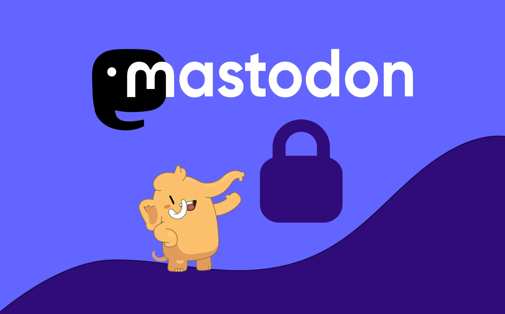

<small aria-hidden="true">Illustration and logo: Mastodon gGmbH | Montage: Em / Privacy Guides</small>

Increasingly more people have joined Mastodon in the recent years. The advantages provided by a decentralized network, using open-source software developed and maintained by a nonprofit organization, are undeniable. Mastodon offers much more robust protections for your privacy than commercial social media do. This tutorial will show you how to make the most of it.<!-- more -->

This tutorial is the second of a **series of two** articles on Mastodon. If you would like to read more about privacy and security on Mastodon, start with reading the [first article](mastodon-privacy-and-security.md) of this series.

This second article will guide you on how to improve your Mastodon account's security, and how to adjust the different privacy features to your preferences. This isn't an onboarding guide to start using Mastodon, but if that's what you seek, you can first take a look at this [short guide](https://docpop.org/2025/02/how-to-get-started-with-mastodon/) from Doc Pop.

Additionally, while self-hosting a Mastodon account offers the most freedom and control over your data, it also requires much more expertise and resources, which isn't realistically accessible to everyone. For this reason, this tutorial will focus on the experience from the **user side**, and not from the administrator side.

<div class="admonition question" markdown>
<p class="admonition-title">Who is this tutorial for?</p>

- You already have an account on Mastodon

- You are *not* familiar with all the Mastodon settings yet

- You are *not* self-hosting your instance

</div>

Although many variations and versions of the Mastodon software are in use on the Fediverse, for the sake of simplification and universality, this tutorial will focus on its most recently released version (4.4).

If your instance software version is different, you will likely still be able to follow this tutorial, but might notice some variations.

<div class="admonition question" markdown>
<p class="admonition-title">What software version is your instance running?</p>

To check which version your instance (server) is currently running, from the web interface on desktop, check the information in the lower-left corner of your instance website (e.g. [https://mastodon.social/](https://mastodon.social/)). The very last line should list something similar to `v4.4.1` This is your instance's Mastodon version number.

</div>

This tutorial was created from the desktop web interface (desktop browser). Experiences and setting accesses may vary greatly from a mobile app. It is recommended to **follow along from the desktop web interface** as well.

Screenshots for the tutorial were mostly taken from an account on the Mastodon.Social instance (server), but you will be able to follow this tutorial even if your account is on a different instance.

<div class="admonition info" markdown>
<p class="admonition-title">Mastodon the software vs the network vs the instance</p>

The Mastodon *software* is different from the Mastodon.Social original *instance* (server), and is different from the Mastodon *network*.

**Mastodon software**: The software used by people on the Mastodon network, and installed by administrators to run an instance (what you see).

**Mastodon network**: The network of interconnected instances using the Mastodon software (all the different Mastodon instances you interact with). The Mastodon network also connects to the larger Fediverse network.

**Mastodon.Social, the instance**: The largest Mastodon server, managed and moderated by the Mastodon nonprofit organization.

</div>

## :octicons-shield-check-16: Improving account security

Using a [unique email address](https://www.privacyguides.org/en/email-aliasing/) and a unique and [strong password](https://www.privacyguides.org/en/basics/passwords-overview/) are the starting points for good account security, and this is no different for Mastodon accounts.

Additionally, you should enable multifactor authentication for your account as soon as you can. This is one of the most important step you can take to increase your account's security, and its protections against account takeover attacks.

### Two-factor authentication

For this, go to "Preferences" (in the right-side menu) > "Account" > "Two-factor Auth", then click on the purple "Set up" button at the bottom.

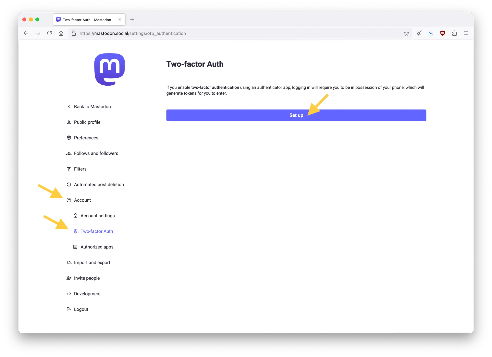

#### Authenticator app

Confirm your password when prompted. Then scan the QR code with your [authenticator app](https://www.privacyguides.org/en/multi-factor-authentication/), or enter manually the plain-text secret on the right of the QR code. Confirm with entering the two-factor code from your authenticator app, then click "Enable" at the bottom.

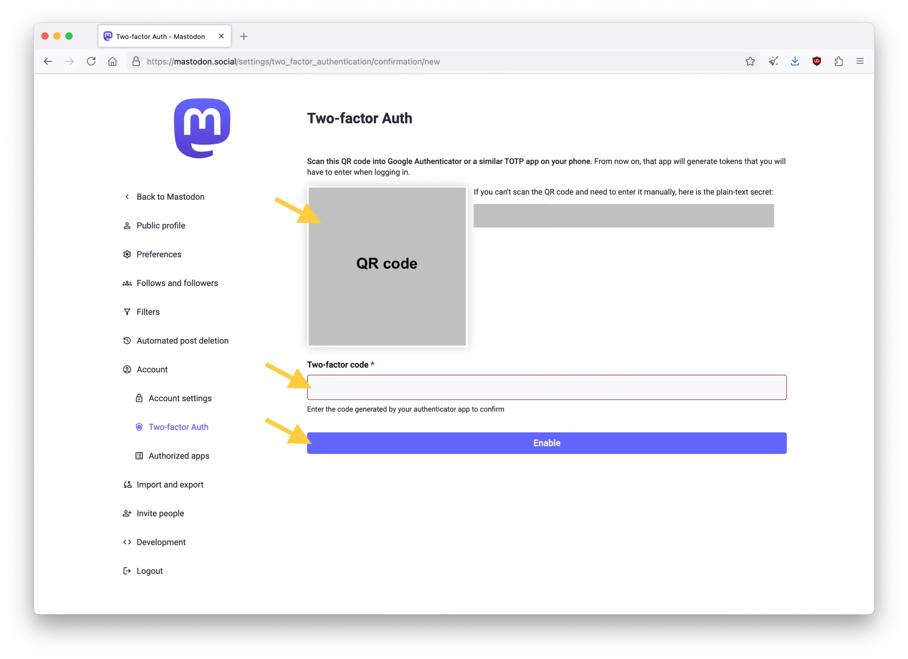

**Carefully note the recovery codes** provided. You will need to use them if you lose access to your authenticator, for example if you were to lose your phone.

If you need to change your authenticator app later, you can go back to this menu and select "Edit" on the right of "Authenticator app". You can also return to this menu to generate new recovery codes, if you have lost your older ones or if they were compromised. Generating new recovery codes will invalidate your previous ones.

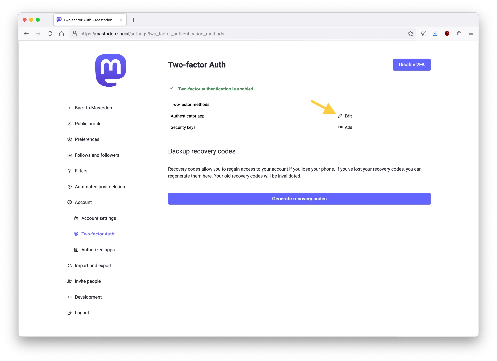

#### Security key

Once you have enabled two-factor authentication with an authenticator app, you will see the option to add a [security key](https://www.privacyguides.org/en/security-keys/) as well. You can add one if you want to register multiple second factors of authentication for your account.

<div class="admonition warning" markdown>
<p class="admonition-title">Browser compatibility</p>

Some browsers will not support security key authentication. For example, the Mullvad Browser doesn't support it.

</div>

To add a security key, click on "Add" on the right of the listing. Insert your security key, choose a "Nickname" for it, then click on the "Add new security key" purple button.


On macOS, you might be prompted with an option to "Choose how to manage your passkeys". If you get this pop-up, click on "Other Options" at the bottom.

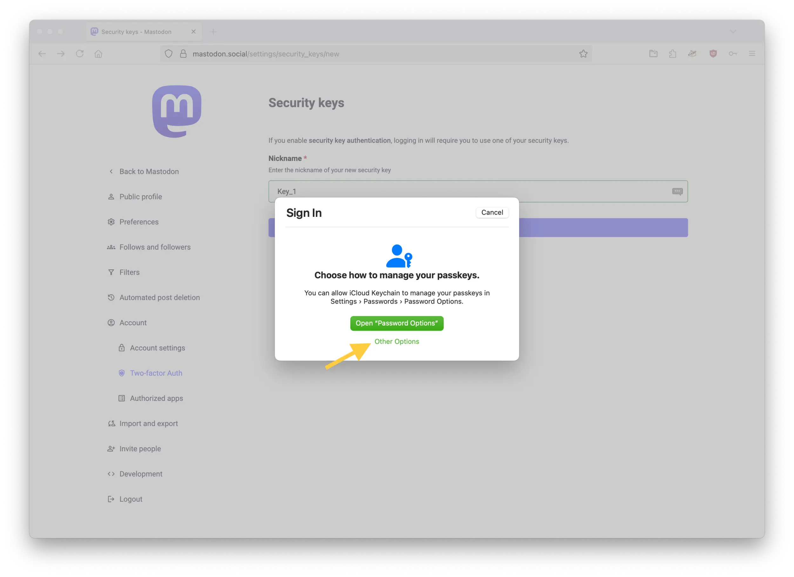

On the second pop-up, select "Security key" then "Continue". When prompted with "Set Up Security Key", activate your security key (for some keys, this means touching the metal part of it). This step may differ depending on your operating system type and version.

Once completed, you should see a confirmation that "Your security key was successfully added" on the page.

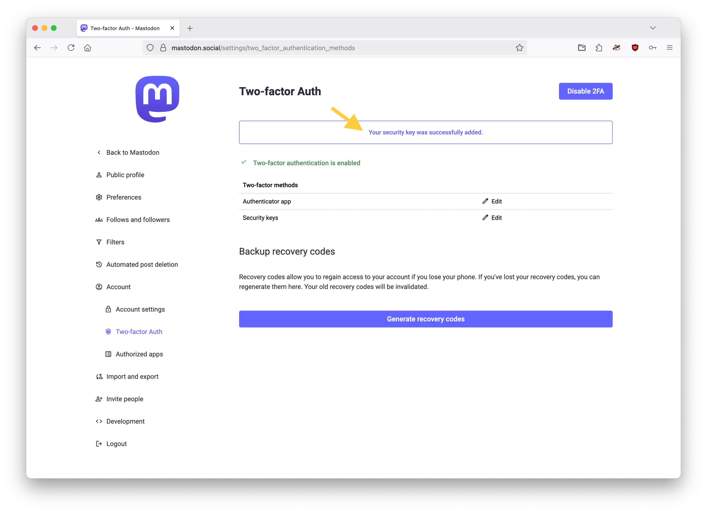

From now, each time you log in your Mastodon account, you will be prompted to select one of your authentication methods after entering your email address and password:

**To log in using your security key**, click on the "Use security key" purple button when prompted by your browser. Your operating system might present you with a pop-up to choose again between your authenticator app or your security key. On macOS, select "Security key", click "Continue", then insert and activate your key. There may be variations depending on your operating system, but it should be similar to this.

**To log in using your authenticator app**, click on the "Enter a two-factor code from your phone or a recovery code" link at the bottom, then enter the code from your authenticator app when prompted by your browser (or recovery code if you've lost your authenticator).

If you try to sign in from a browser that doesn't support security keys after enabling it (or if you lost access to your security key), you can still log in your account using your authenticator app as described above.


Keep in mind that adding *more* methods of authentication to your account *doesn't* make it more secure, it's the opposite.

If you register both an authenticator app *and* a security key, this means anyone who can access *either* your authenticator app *or* your security key could log into your account (if they already have your password). Different second factors aren't added together here, they simply provide more options to *access* your account.

<div class="admonition warning" markdown>
<p class="admonition-title">When enabling multifactor authentication with any account</p>

Be careful to choose a method you will have access to easily each time you log in. In addition, make sure to note the recovery codes provided *very carefully* and store them in a secure location (ideally offline). Keep in mind these codes will allow you to recover your account, but could also allow *anyone* to bypass your multifactor authentication.

</div>

### Account accesses

In "Preferences" > "Account" > "Authorized apps", you can see which applications have access to your account.

There, you will see every application you have granted access to. If you no longer use a mobile app or a service listed there, you should revoke access.

If you do not recognize a listed service, you can ask your instance administrator to know if this is a legitimate application (some administrators might connect legitimate services to your account you may not recognize, such as Matrix).

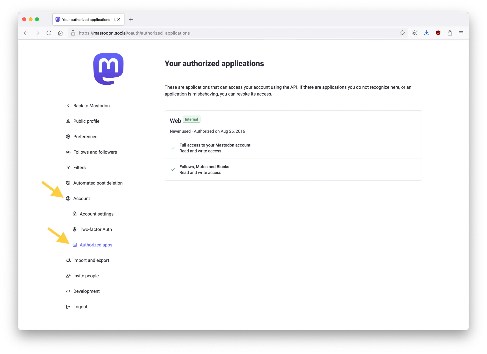

### Sessions and login history

Additionally, in "Preferences" > "Account" > "Account settings", in the "Sessions" section, you will find a list of authorized browser sessions. Again, you can revoke access to any sessions you no longer use, or do not recognize.


Just above this sessions list, you will see a link labeled "View authentication history of your account". Click on it to see a list of past logins, including applications used and IP addresses.

If you see a login that isn't legitimate, you should *immediately* revoke accesses you aren't using, and consider changing your password.

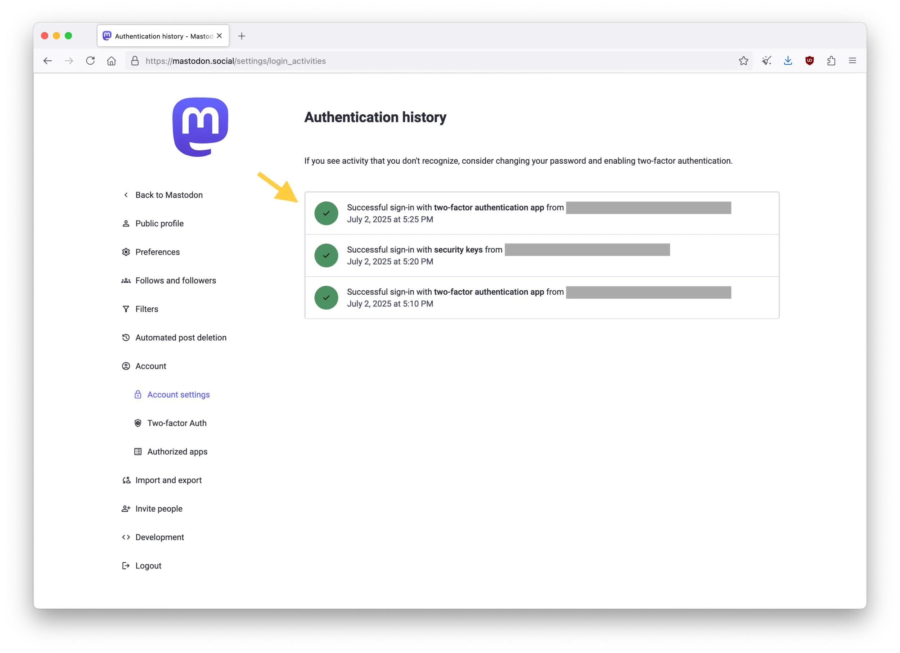

## :octicons-lock-16: Adjusting privacy vs discovery

When using social media, there's usually a sliding scale between privacy and discoverability.

You might decide to enable the most restrictions on your account's visibility (more privacy), make it as public as possible (more reach), or anything in between.

**Only you can decide what is best for your unique situation and usage.**

On Mastodon, you have many options to adjust this to your preferences and needs. In "Preferences" > "Public profile", select the "Privacy and reach" tab at the top.

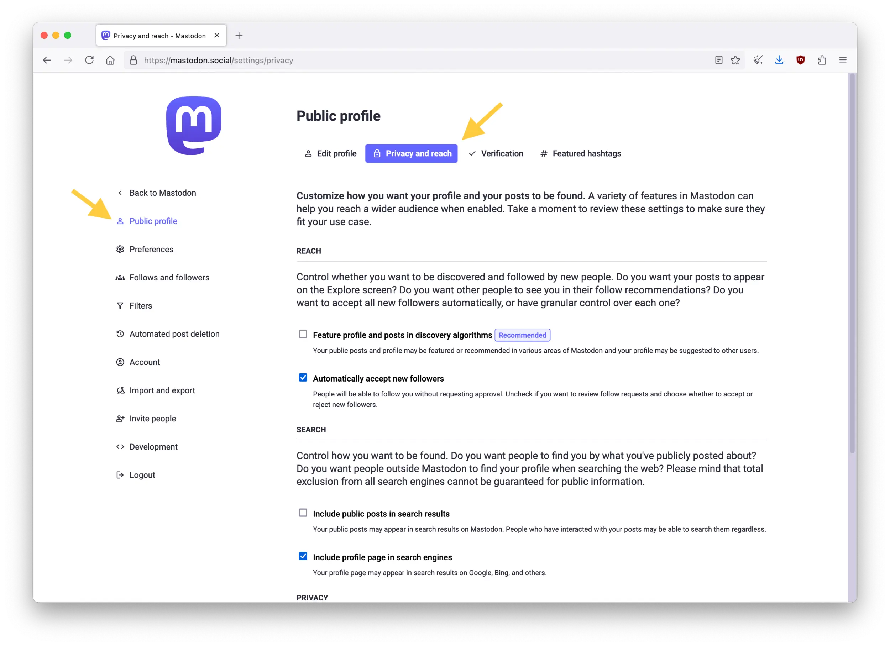

### Reach

- The option "Feature profile and posts in discovery algorithms" allows more people to find your account and public posts (default is unchecked). **Leave it *unchecked* for more privacy.**

- The option "Automatically accept new followers" allows anyone to be able to follow you (default is checked). Approving each follower can increase the privacy of your follower-only posts. **If you prefer to approve each new follower (locking your account), then *uncheck* this option.**

### Search

- The option "Include public posts in search results" allows people to be able to find your public posts when searching for keywords in Mastodon (default is unchecked). **Leave it *unchecked* for more privacy.**

- The option "Include profile page in search engines" allows your Mastodon profile to potentially appear in search engine results, like Google and Bing (default is checked). ***Uncheck* this option to increase your account's privacy.**

### Privacy

- The option "Show follows and followers on profile" allows anyone to be able to see who you follow and who follows you (default is checked). If you prefer to hide this from the public, ***uncheck* this option for more privacy.**

- The option "Display from which app you sent a post" will display publicly which application you are posting from for each post (default is checked). If you prefer to not show which app(s) you are using, ***uncheck* this option for more privacy.**

Once you have adjusted the account options to your preferences, click on "Save changes" at the bottom to confirm your choices.

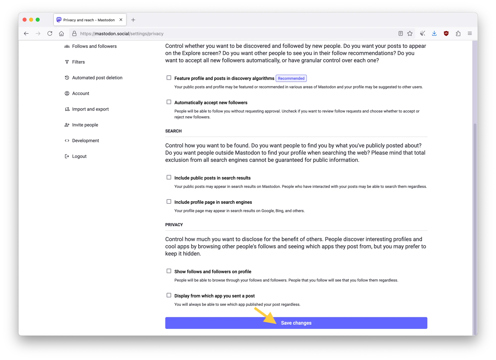

## :material-message-lock-outline: Selecting post visibility and access

In addition to your account's privacy preferences, you can also adjust visibility for each post. This is very handy to allow you to pick in a more granular way which information you wish to share more or less openly.

On Mastodon, you can choose between 4 types of visibility for each post: Public, Quiet public, Followers, and Private mention.

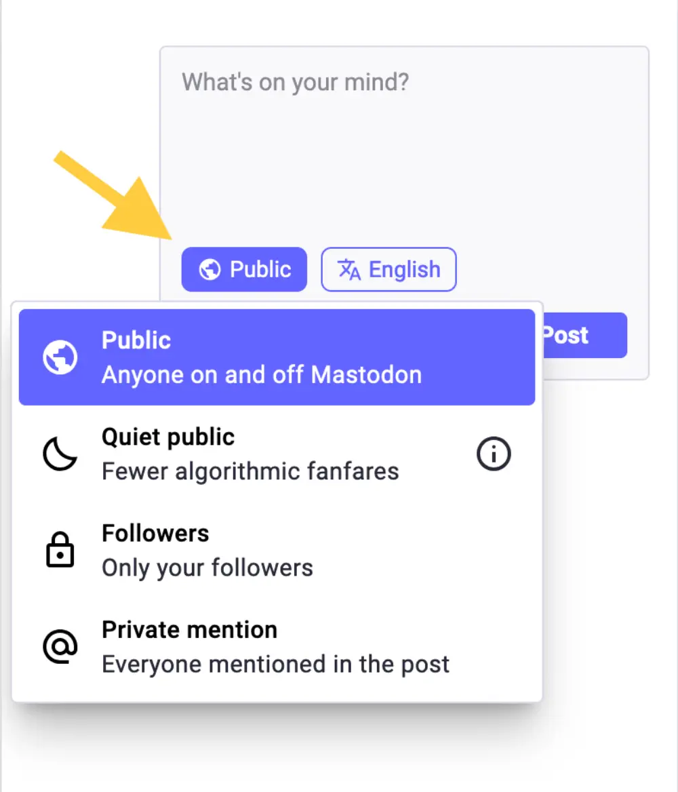{width="400"}

### Public post

This post is visible to anyone, whether they follow you or not. This post will also be visible from your account's public page, to people who do not necessarily have a Mastodon account.

For example, if you log *out* of your account, then go to `https://YOUR_INSTANCE_ADDRESS/@YOUR_USERNAME`, you will see what someone outside of Mastodon could see from your public page.


<small aria-hidden="true">Note: Please do not follow this account. This account is for research purposes only, and is not an official Privacy Guides account.</small>

### Quiet public post

This post is visible to anyone, and is also visible from your account's public page (like a Public post). However, it will not be featured in the "Trending" or "Live feeds" timelines. Additionally, it will not be searchable. This reduces its public exposure slightly, and is sometimes recommended for replies.

### Followers post

This post is only visible to your followers. If you enabled the option to approve each follower, then only people you have approved will see this post. Followers-only posts cannot be boosted (re-posted) by others, and will *not* appear on your account's public page.

Your Followers-only posts will have significantly less reach, and potentially less engagement, but will be much more private.

<div class="admonition tip" markdown>
<p class="admonition-title">Followers-only post and approving followers</p>

An important thing to keep in mind when selecting a post's visibility is who your followers are (or could be).

If you select Followers-only, but anyone could follow you, this restriction will block boosts for this post, and remove visibility from your account's public page, but anyone who decided to follow you can see it.

However, if you *also* enable restrictions on who can follow you, you will have more control over the visibility of your Followers-only posts, by pre-approving who can follow you and see these posts.

</div>

### Private mention post

This post is only visible to the people mentioned in it. This works like a "Direct message" feature, except that anyone mentioned will be included.

Be careful not to write the handle of someone you do not want included in this conversation! Because this *will* include them.

Additionally, always keep in mind that the administration and moderation team of your instance *could* see all your posts, including your Private mention posts (like it is the case for any other social media). Never share sensitive information in Private mention posts!

{width="400"}

<div class="admonition info" markdown>
<p class="admonition-title">End-to-end encryption for private mentions</p>

There is currently work being done to [integrate end-to-end encryption](https://socialwebfoundation.org/program-protocol-e2ee/) to the ActivityPub protocol, potentially making end-to-end encrypted private mention on Mastodon possible one day.

Implementing end-to-end encryption properly is no small task, and understandably it could take some time for this to be ready for Mastodon users.

However, it would make your private mentions truly private, being accessible only to its intended sender(s) and recipient(s). This could be groundbreaking for the Fediverse, and for your privacy!

</div>

### Default post visibility

Even if you can adjust visibility for each post, you may also want to adjust your account's *default* post visibility.

For example, this can help by preventing accidentally sharing something publicly if posting to followers only is preferred, especially if your account is locked for more privacy.

To adjust the default post visibility, go to "Preferences" > "Preferences" > "Other". In the "Posting privacy" section, select your preference in the "Posting privacy" drop-menu for either "Public - Everyone can see", "Unlisted - Everyone can see, but not listed on public timelines", or "Followers-only - Only show to followers".

Confirm your choice by clicking on "Save changes" on the upper-right.

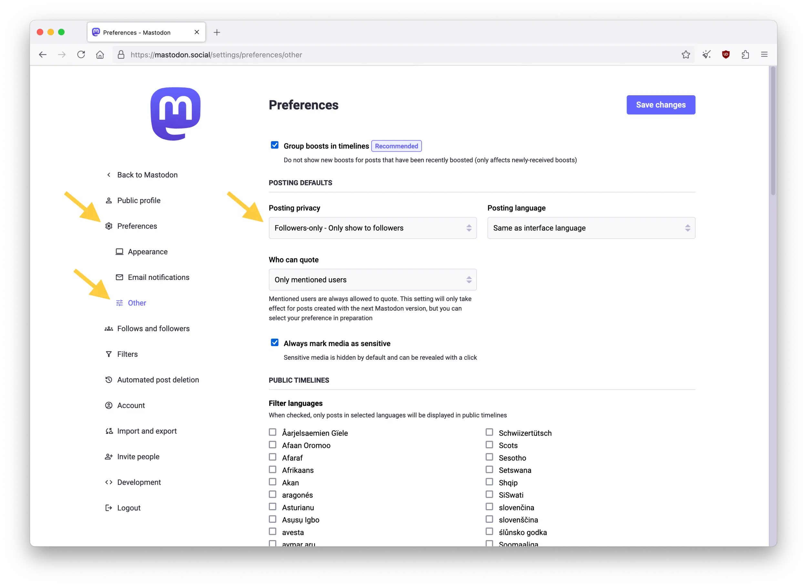

<div class="admonition tip" markdown>
<p class="admonition-title">Hide posted media (slighly)</p>

Additionally, you might want to check the "Always mark media as sensitive" option from the same section. This will label the media as "Sensitive content", and require others to click on it to view the image. This will **not stop anyone from clicking to view it**, including people without a Mastodon account from your account's public page, but it might *slightly* reduce the visibility for certain media.

Depending on the content, your instance may have some rules requiring to hide certain type of content. Make sure to consult your instance's Server rules about this.

</div>

### Quote posts

Mastodon version 4.4 is already preparing for the implementation of a new [Quote Posts feature](https://blog.joinmastodon.org/2025/02/bringing-quote-posts-to-mastodon/) coming up in Mastodon 4.5. Quote posts have been long requested and debated on Mastodon.

Mastodon didn't lack quote posts accidentally, it was a deliberate choice from the development team to [reduce potential abuse](https://techcrunch.com/2025/07/08/mastodons-latest-update-readies-the-app-for-quote-posts-revamps-design/). This is why the team has been very careful, taking the time to implement this new feature properly, and giving options for Mastodon users to opt out.

Again, this shows how Mastodon differs from commercial social media, by prioritizing users' safety and control over monetizing attention.

To give control to the users, important options have been planned out:

1. People will be able to choose if they want their post to be quoted or not
2. People will be notified when their post is quoted
3. People will be able to **withdraw their post from being quoted** at any time

These options greatly reduce the potential for abuse when quoting posts, a behavior we have sadly all witnessed on commercial social media with a culture of dunking on others.

From Mastodon version 4.4, you can already decide which permission you want to allow for your posts to be quoted. This is only in preparation for the feature for now, the final implementation should be available in the [next software update](https://blog.joinmastodon.org/2025/07/mastodon-4-4-for-devs/).

To adjust this in preparation, go to "Preferences" > "Preferences" > "Other". From the "Posting defaults" section, find the drop-menu labeled "Who can quote", and select either "Everyone", "Followers and mentioned users", or "Only mentioned users".

Confirm your choice by clicking on "Save changes" on the upper-right.


## :material-checkbox-marked-circle-outline: Verifying yourself and others

The account verification process on Mastodon is excellent. Not only is it free, but it doesn't require you to provide any official ID or other intrusive documentation to proof your identity. It is a privacy-respectful verification feature.

The way it functions is very simple: Verification works by providing a *proof of control* over a website, or a web page.

For example, if you are the official Mastodon account for the privacyguides.org website, you can easily add a simple invisible link to this website to confirm that this Mastodon account is official. Once the verification process is completed, the Mastodon account profile page will display a **verified link in green with a checkmark**, confirming this account is authorized by the owner of this website (or web page).

From a profile page, it looks like this:

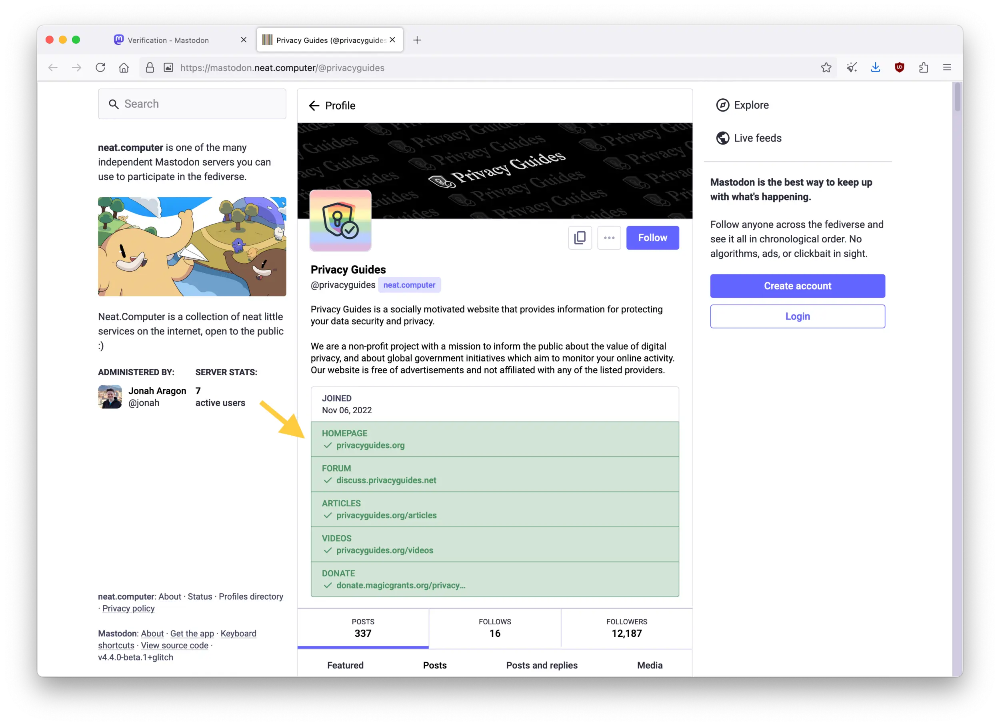

All the links displayed in green with a checkmark have been verified from the listed websites.

This is **a feature very important to use for organizations**. It confirms to readers and followers this Mastodon account is authorized and truly belongs to the organization. It's also important for any individuals, writers, and journalists who want to confirm their identity to the public.

Looking for these verified links, other Mastodon users can validate if an account is legitimate, increasing trust and security.

### Account verification

If you would like to verify your own account, here's how you can do it yourself.

It's easy, and it's free!

Go to "Preferences" > "Public profile", then select the "Verification" tab at the top. From there, follow the instructions to copy the link to the web page you want to use to verify your account.

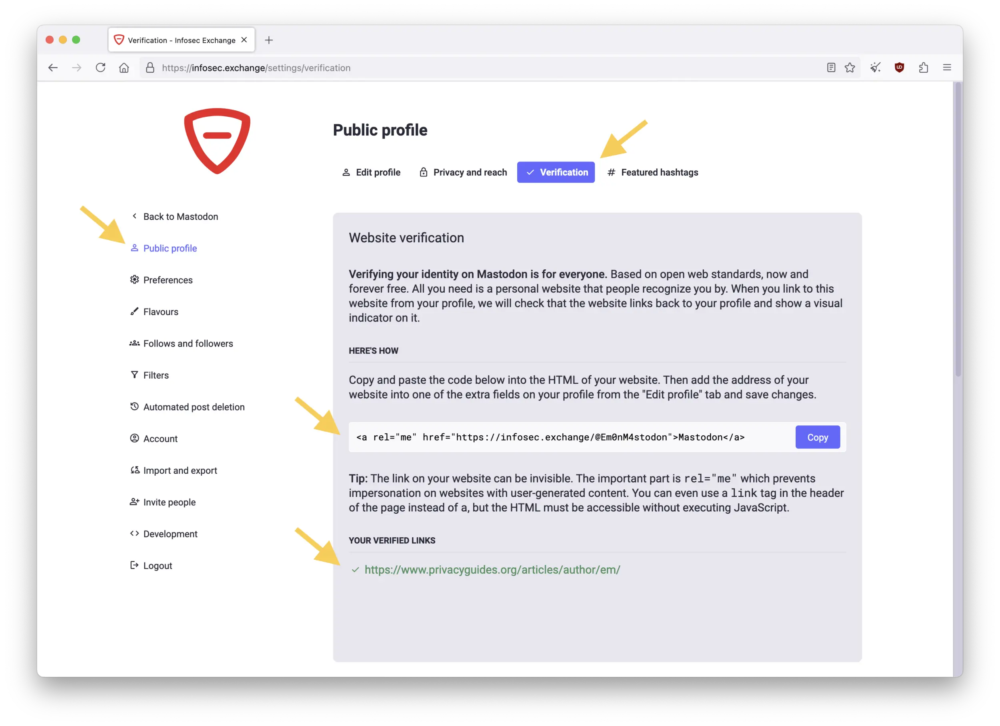

If you prefer not to add a Mastodon link to your web page, you can simply add this HTML line in the web page's head section (replacing `https://YOUR_INSTANCE_ADDRESS/@YOUR_USERNAME` with the link to your own Mastodon account):

```html
<link href="https://YOUR_INSTANCE_ADDRESS/@YOUR_USERNAME" rel="me">
```

### Author attribution for journalists and writers

In addition to the verification process available to everyone, Mastodon recently [added](https://blog.joinmastodon.org/2024/07/highlighting-journalism-on-mastodon/) a feature specifically for writers and journalists!

Since last year, journalists and bloggers alike can link their articles to their Mastodon account. This validates their identity, while also increasing their Mastodon account's discoverability from article links. This is fantastic feature!

Popular websites like TechCrunch, ProPublica, and of course Privacy Guides have already adopted it! You might have noticed this feature previously, for example if you found this article from a Mastodon post.

To add author attributions to your articles, scroll down the same page and simply add the provided link to each of your article's HTML page, then lists the website(s) allowed to credit you below:

```html
<meta property="fediverse:creator" content="@YOUR_USERNAME@YOUR_INSTANCE_ADDRESS">
```

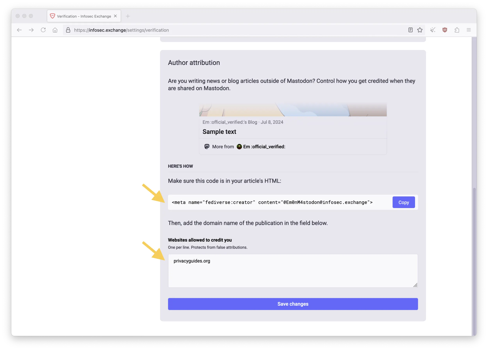

## :material-folder-multiple-outline: Deleting and accessing your data

Data deletion is a fundamental part of data privacy, and a protected right under many privacy laws.

Mastodon makes data deletion effortless. You will never have to battle the insufferable BigTech™️ customer service to request your data to be deleted on Mastodon. You can control most of it just by yourself.

### Automated post deletion

First, you can easily set up automatic post deletion and adjust it to your precise preferences. This is a rare feature on social media, and demonstrates once again how Mastodon prioritizes users' benefits over data monetization.

To enable it, go to "Preferences" > "Automated post deletion", then check the option "Automatically delete old posts" on the upper-left. Adjust the "Age threshold" on the upper-right to anything between 1 week and 2 years.

In the "Exceptions" section below, you can select a number of variables to customize post deletion. Keeping your pinned posts from being deleted is likely a good idea, for example.

You can also keep the option checked to protect from deletion your own posts that you have favorited. This is very convenient to get a more granular control over automated deletion, purposefully keeping some posts while letting others getting automatically deleted.

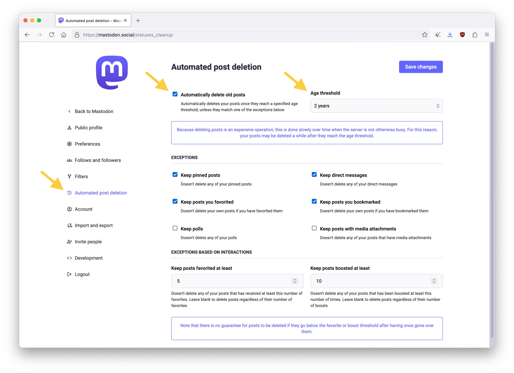

In the "Exceptions based on interactions" section, you can select a threshold of favorites and/or boosts to protect posts from automatic deletion.

Once you have adjusted automated deletion to your preferences, click on "Save changes" on the upper-right to confirm your choices.

### Data access and backups

Another important side of digital rights is access to your own data. Here again, Mastodon makes it easy. You can download a copy of your account data any time you want.

For this, go to "Preferences" > "Import and export" > "Export". From there, you can request a compressed archive of all your posts and uploaded media once every 7 days. This archive will be readable by any ActivityPub-compatible software, or you can open it with any simple text software.


Additionally, you can download lists of your Follows, Followers, Lists, Mutes, Blocks, Domain Blocks, and Bookmarks in CSV format any time (also readable with any simple text software).

Keeping a local copy of your data for regular backup purposes is a good idea in general, and also recommended before an account migration.

### Account deletion

Finally, if you decide to delete your *whole* account, this is again incredibly easy. Simply go to "Preferences" > "Account" > "Account settings", and scroll down to the bottom of this page.

Once you are ready to delete your data (and have downloaded the data you wish to keep), click on the "proceed here" link. Read the information from the "Account deletion" page, and enter your password when you are ready to confirm.

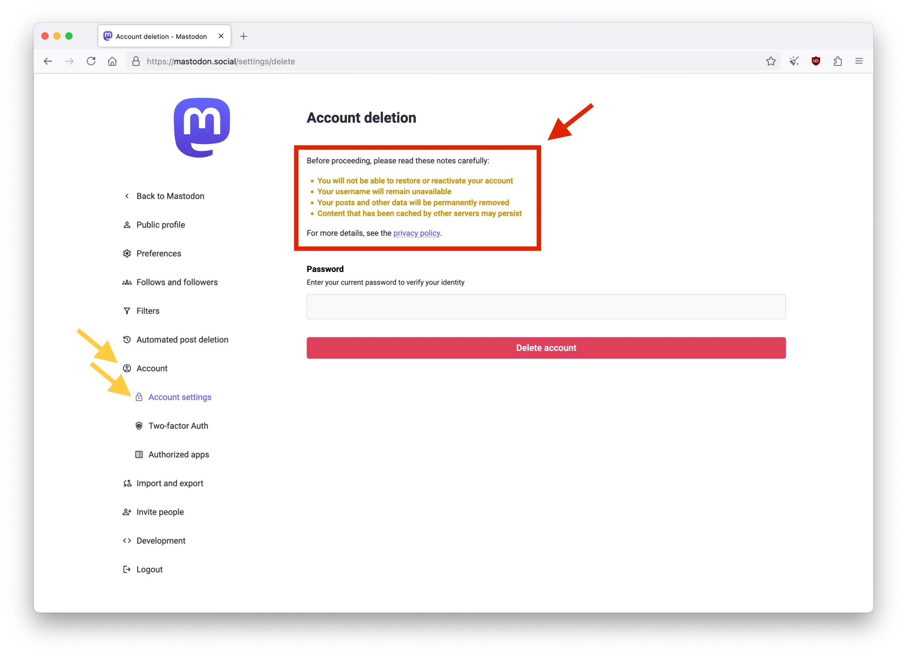

## :octicons-blocked-16: Blocking users and instances

You have a lot of control on which information you show and see on Mastodon. Like for other social media, you can block users individually on Mastodon. But additionally, you can also block a whole instance if you aren't happy interacting with it. This, like an individual block, can benefit your privacy by restricting further who can access your posts.

<div class="admonition info" markdown>
<p class="admonition-title">Filtering content and muting users</p>

This tutorial will not discuss in details all the Mastodon features, as it focuses on privacy and security. However, it's worth mentioning briefly that there are softer options than blocking, if you simply wish not to see some content on Mastodon.

First, you can use [Filters](https://docs.joinmastodon.org/user/moderating/#filters) to hide specific content or hashtags from your timelines. Second, you can [Mute](https://docs.joinmastodon.org/user/moderating/#mute) a user, temporarily or permanently. However, remember that muting a user will still allow them to see your posts. Since Mastodon 4.4, you can also use "Remove follower" to simply remove someone from following you, without having to block them.

</div>

### User block

If you block a user, this person will not be able to interact with you, and will not see your posts from their account anymore. They could however still see your public and quiet-public posts from your account's public page.

<div class="admonition tip" markdown>
<p class="admonition-title">Adding a Personal Note</p>

If you want to remember why you blocked (or muted) someone, you can [add a Personal Note](https://fedi.tips/what-are-notes-on-mastodon-what-does-click-to-add-note-mean-on-mastodon-profiles/) on their profile page. They will not be able to see this note, but your notes could be read by your instance's administration or moderation team. Be careful what you write there. Notes cannot be transferred during account migration at this time.

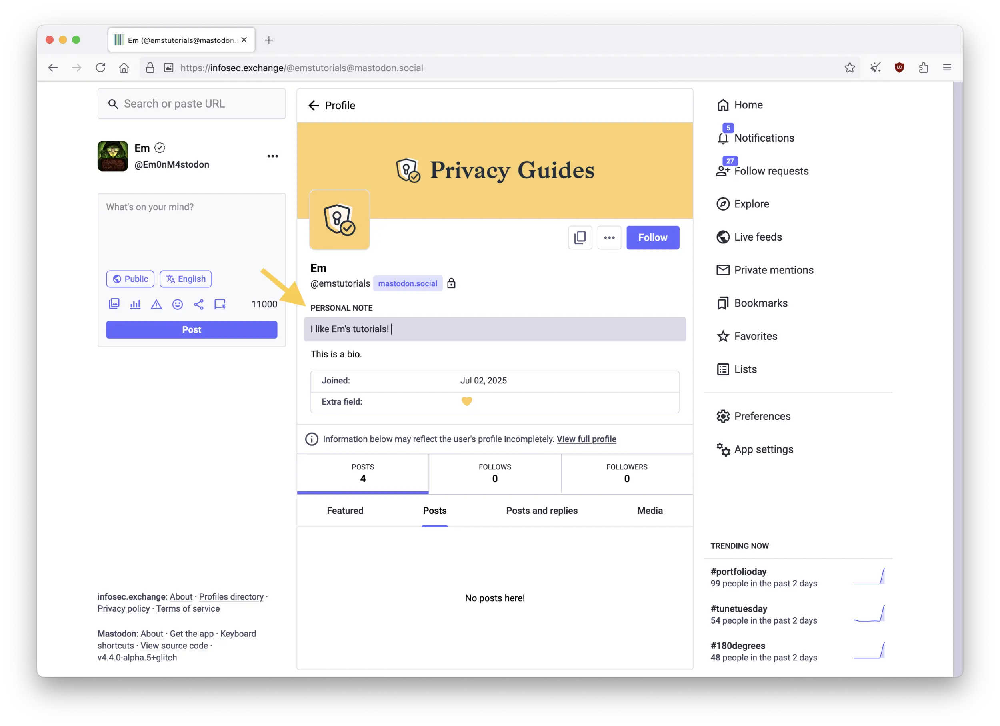

</div>

To block a single user, find their profile and click on the 3-dot "Menu" button on the upper-right. From the drop-menu, select "Block `USERNAME`".


<div class="admonition warning" markdown>
<p class="admonition-title">Blocked users can still visit your account's public page</p>

Remember that blocked accounts (and instances) might still be able to see your public and quiet-public posts outside Mastodon, by visiting your account's public page. Although, they will not be able to interact with your posts anymore.

</div>

### Instance block

If you block an entire instance, *everyone* from this instance will stop seeing your posts, you will stop seeing theirs, and they will be removed from your followers and follows. Nobody from this instance will be able to follow you anymore, and you will not be able to follow them either.

There are two ways to block a whole instance. The simplest way is to find a user from that instance and click on the 3-dot "Menu" button on their profile. From the drop-menu, select "Block domain `DOMAIN_NAME`".

<div class="admonition danger" markdown>
<p class="admonition-title">This blocks everyone from that instance</p>

Remember this will block *everyone* using this instance at once, and you will lose *all* followers and follows you may have from this instance as well. You might not be able to recover those followers if you change your mind later.

</div>


Alternatively, you can even "pre-block" an instance on Mastodon. For example, many people used this method when Meta's Threads announced they would connect to the Fediverse, but didn't have any connected accounts yet.

To do this, go to "Preferences" > "Import and export" > "Export", then download the "CSV" file for your "Domain blocks".

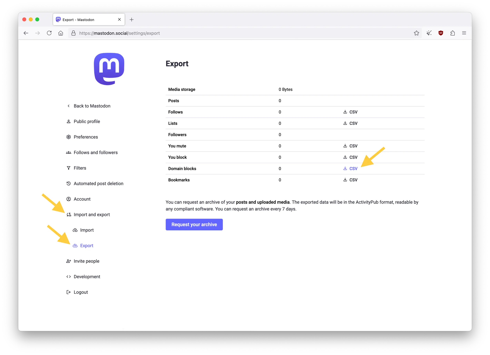

Open the `blocked_domains.csv` file as a text file, then type each domain you wish to block. Use one line for each domain (if you want to block more than one). Save this file using the same filename.

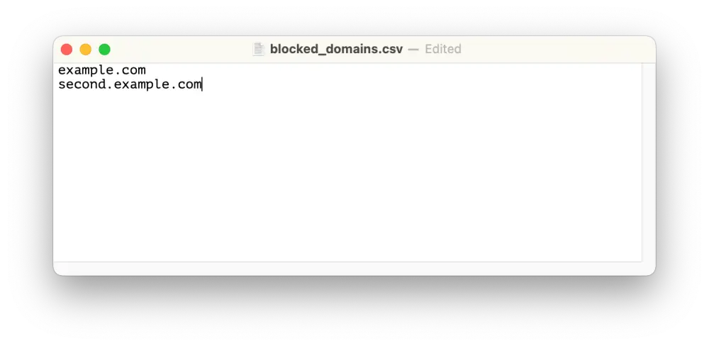

Back to your account, move to the "Import" section from the left-side menu. From the "Import type", select "Domain blocking list".

Keep the "Merge" option on if you want to *add* new domains to block, or select "Overwrite" to replace your old list with this new list. Browse to upload the file you just modified, then click "Upload".

<div class="admonition warning" markdown>
<p class="admonition-title">Carefully verify the correct type!</p>

Make sure to select "Domain blocking list" in the "Import type" or you could accidentally overwrite other important data! For safety, always save a backup of your existing data before doing any modifications like this.

</div>

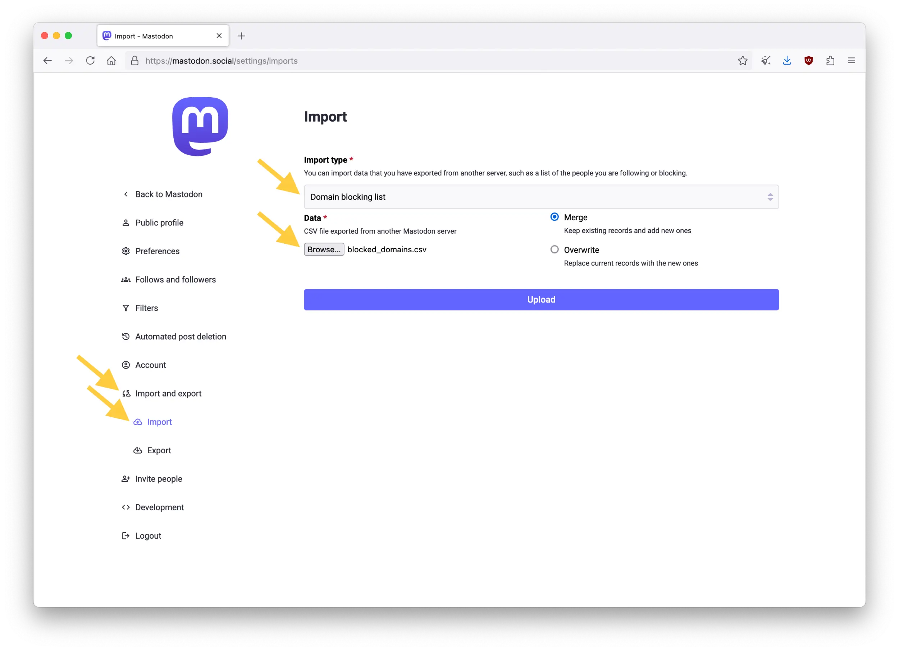

You will be prompted to confirm. Verify the information is correct, then click "Confirm". You should see a confirmation message with "Your data was successfully uploaded and will be processed in due time". You can now leave this page.

### User report

Reporting users isn't necessarily directly linked to privacy and security (although it can be), but it's still an important mechanism to address the overall safety of the network.

Because moderators have less resources on the Fediverse, they rely on users reporting problematic posts in order to enforce moderation policies.

As a member of your instance's community, it's important to report posts violating your instance's Server rules, but it's also important not to misuse report mechanisms when there are no violations.

To report a post, click on the 3-dot "More" button on the lower-right of the problematic post, then select "Report `USERNAME`".

Answer the form to the best of your knowledge, and **try to be as helpful to your instance's moderation team as you can, without overwhelming them**.


<div class="admonition warning" markdown>
<p class="admonition-title">Do not report if there are no policy violations</p>

People who volunteer to moderate an instance are doing it for the community. It's important to respect their time, to stay kind, and to not abuse reporting mechanisms.

Only report content that violates the policies of your instance, or theirs. Do not report users simply because you dislike their posts. There are better mechanisms to hide the content you simply dislike, such as Filters, Mutes, or Blocks.

</div>

## :fontawesome-solid-hashtag: Opting out with hashtags

Data privacy and user consent are principles strongly valued by the Fediverse community. Sometimes, developers trying to create tools for the Fediverse or utilizing its user data without prior explicit consent have come into conflict with these values.

Unfortunately, despite how illegal it may be, there aren't many technical barriers to stop malicious actors from violating users' consent.

### Special hashtags

However, many developers creating tools for the Fediverse actually *do care* about respecting these values, and want to build tools the right way.

Some have implemented methods to opt in or opt out the data they collect or the tools they build. This is why you will sometimes see people adding special hashtags in their profile biography, such as `#noindex`, `#nosearch`, `#nobot`, `#noai`, `#nobridge`, etc.

Ideally, all data collection should be prohibited until users' consent is obtained, and data subjects notified (opt in default). This is obligatory by law for many jurisdictions. Sadly, many developers do not follow sound legal practices in reality, and will not seek users' consent, despite their legal and moral obligations.

Adding these hashtags (and maybe others in the future) to your profile biography *might* help to opt out certain data collection and certain tools built by developers who do respect users' consent. This can effectively *reduce* data scraping, in some situations. If anything, it is at least a public statement against disrespectful (and sometimes illegal) practices.

## :material-arrow-right-bold-box-outline: Moving to another instance

The freedom to move from one instance to another can greatly contribute to keeping Mastodon a place that puts its users first.

If suddenly your instance were to implement a data scraper for its AI model to train on all your content (like so many commercial social media do now), or drastically drop moderation, you could simply move your account to another instance, one that is more respectful of your values and privacy rights.

This is a feature completely absent from centralized social media. Allowing them to unleash unchecked user exploitation, knowing fully users feel trapped and somehow forced to endure the abuse on their platforms.

Mastodon is protected again such abuse, by design.

When investing your precious time and energy participating in a Fediverse community, you will retain your data and your agency to choose which type of administration you prefer.

If you are unhappy with your Mastodon instance's management, here's how to leave for greener pastures:

### Planning your move

First, plan your move properly. While moving your account is easy enough to do, there is a 30 days cooldown period in which you will not be able to move your account again. Make sure to choose your new home (instance) carefully, you will be there for *at least* 30 days.

Then, you might want to inform your followers. While moving followers is done automatically, it may take a few hours before completion, and your followers might be wondering what is going on. It can be a good idea to post about it from the account you are moving away from before moving.

<div class="admonition success" markdown>
<p class="admonition-title">Summary of the steps to follow</p>

1. Save an archive of your posts (if you want)
2. Save a copy of the six CSV files in "Export" (to import later)
3. Choose a new instance
4. Create a new account on your new instance (you can use the same username if available)
5. Alias your two accounts
6. Move your old account to the new one
7. From your new account: Wait that your followers are all transferred
8. From your new account: Import data and verify that everything is transferred properly
9. From your old account: Delete your older account (if you want)

</div>

### Backing up your data

The first step is to back up your data. This is important both for security and to allow you to import it later to your new account (some data isn't transferred automatically).

Go to "Preferences" > "Import and export" > "Export", then click the "Request your archive" purple button at the bottom.

Wait for the archive to be ready (you should receive an email notification within a few minutes), then download your precious archive somewhere secure.

Do not stop there!

You also need to download the CSV files above to import them manually to your new account. For each line with a CSV option on the table below ("Follows", "Lists", "You mute", "You block", "Domain blocks", and "Bookmarks"), download the CSV file in a secure location. Be careful not to forget anything.


<div class="admonition warning" markdown>
<p class="admonition-title">Your posts will not be moved!</p>

Unfortunately, you will not be able to import your posts to your new Mastodon account (yet).

But this might change soon! The ActivityPub team is currently working on a [live online account portability protocol (LOLA)](https://swicg.github.io/activitypub-data-portability/lola) that could get added to Mastodon relatively soon. This will be a wonderful improvement to this process, and allow even more freedom and agency to Mastodon users!

</div>

### Moving your account

Once you have backed up your data, informed your followers, and created a new account on your instance of choice, you can start the migration process.

**From your new account:** Go to "Preferences" > "Account" > "Account settings", scroll down to "Moving **from** a different account", and click on "create an account alias".

In the field labeled "Handle of the old account", enter the complete handle (`@YOUR_USERNAME@YOUR_INSTANCE_ADDRESS`) of the *old* account you want to move *from*. Then click on "Create alias" at the bottom to confirm.

This will not initiate the migration yet. It will only create an alias, and it is reversible.


**From your old account:** Go to "Preferences" > "Account" > "Account settings", scroll down to "Move **to** a different account", and click on "configure it here".

Carefully read the information on this page. Enter the *complete handle* (`@YOUR_NEW_USERNAME@YOUR_NEW_INSTANCE_ADDRESS`) of the new account you want to move *to* in "Handle of the new account". Confirm with your current (old) account password on the right, then click on the "Move followers" purple button at the bottom.

**This will initiate the migration process.**

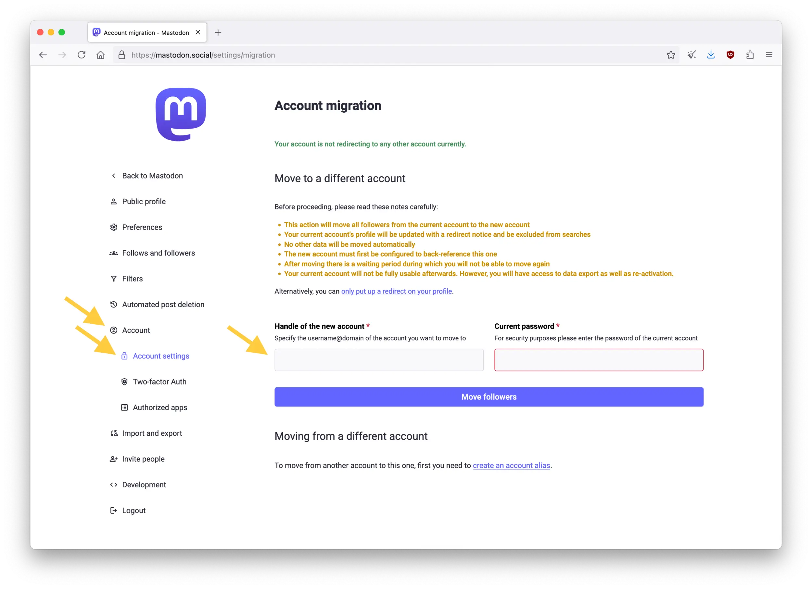

Moving all your followers to your new account might take some time, but normally should be fully completed within 24 hours.

Besides waiting for your followers to migrate, you will also need to manually import your "Following list", "Bookmarks", "Lists", "Muting list", "Blocking list", and "Domain blocking list". For this, go to "Preferences" > "Import and export" > "Import".

For **each** of these 6 types of data, select a type in the "Import type" drop-menu, then click on "Browse" to upload the corresponding file you have exported earlier in the [Backing up your data](#backing-up-your-data) step.

Choose "Merge" on the right if you want to *add* this old data to data your already have on your new account, or "Overwrite" if you want to only keep data from your old account. Then click "Upload" below.

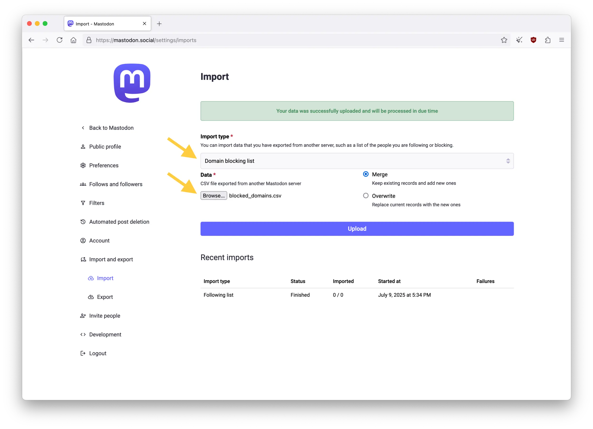

There you go! Your Mastodon account was successfully moved from one Mastodon instance to another!

<div class="admonition success" markdown>
<p class="admonition-title">Delete your old account (if you want)</p>

You may want to delete your old account once you have completed your account migration and verified all your followers and data were transferred properly.

If your old instance isn't shutting down, you can also keep it of course. But remember that keeping an account abandoned in the long-term can create some security issues.

</div>

## :material-hand-heart-outline: Consider supporting Mastodon

Mastodon is supported by its community! If you enjoy the platform and can contribute, consider supporting the project by:

- [Donating to support Mastodon's development and operations](https://joinmastodon.org/sponsors)

- Donating to your Mastodon instance (ask your administrator)

- [Buying cute merch from the Mastodon organization](https://shop.joinmastodon.org/)

- [Contributing to the Mastodon project on GitHub](https://github.com/mastodon/.github/blob/main/CONTRIBUTING.md)

- [Starting your own Mastodon instance](https://docs.joinmastodon.org/user/run-your-own/)

- [Talking to your friends and family about joining the Fediverse!](https://jointhefediverse.net/join)

<div class="admonition info" markdown>
<p class="admonition-title">More information</p>

For more information on Mastodon and the Fediverse, you can visit the excellent website [Fedi.Tips](https://fedi.tips/).

</div>

<small aria-hidden="true">Unless credited otherwise, all screenshots from: Privacy Guides</small>
